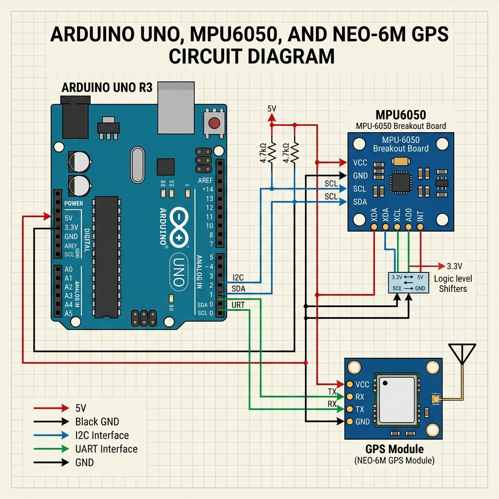

# 🚧 PotholeGuard AI — Real-Time Edge-AI Pothole Detection System

<p align="center">
  
</p>

<p align="center">
  <a href="#-demo-video"><strong>▶ Watch Demo Video</strong></a> &nbsp;•&nbsp;
  <a href="#-getting-started"><strong>Quick Start</strong></a> &nbsp;•&nbsp;
  <a href="#-system-architecture"><strong>Architecture</strong></a> &nbsp;•&nbsp;
  <a href="#-detection-logic"><strong>Detection Logic</strong></a>
</p>

<p align="center">
  
  
  
  
  
</p>

---

## 📌 Project Overview

**PotholeGuard AI** is a professional-grade, real-time pothole detection system built on the **Edge AI** paradigm. It simulates an instrumented vehicle that continuously monitors road surface quality using an **MPU6050 accelerometer**, processing shocks directly on-device (Arduino) with sub-millisecond latency, then visualizing every event on a live web dashboard.

> **Problem**: India loses ₹2.87 lakh crore annually due to poor road conditions. Manual inspection is slow, expensive, and infrequent — leaving dangerous potholes unaddressed for months.

> **Solution**: A low-cost embedded system + AI bridge that continuously monitors roads, flags potholes in real-time, and logs geo-tagged events for infrastructure authorities.

### 🎯 Project Goals

| Goal | Status |
|------|--------|
| Simulate Arduino + MPU6050 + GPS in Wokwi | ✅ Complete |
| Implement "Dip-then-Spike" detection algorithm | ✅ Complete |
| Build FastAPI WebSocket bridge | ✅ Complete |
| Real-time Chart.js dashboard (60 FPS) | ✅ Complete |
| Synthetic dataset generation (500+ rows) | ✅ Complete |
| Continuous loop simulation for demos | ✅ Complete |

---

## 🎬 Demo Video

### What the Demo Shows

The demo video shows the **complete end-to-end working system** — from the Wokwi simulation boots to live pothole events appearing on the dashboard in real time.

- **Wokwi Simulation** — Demonstrates the Arduino firmware initializing the MPU6050 and streaming Z-axis acceleration data over a virtual serial port.
- **Python Bridge** — Shows the FastAPI bridge connecting to the simulation, parsing serial output, and broadcasting JSON alerts via WebSocket.
- **Normal Road Baseline** — The live graph holds steady around **1.0g**, confirming the system correctly identifies non-hazardous conditions.
- **Pothole Detection Event** — When a pothole impulse hits, the graph shows the **"Dip-then-Spike"** signature and the dashboard instantly flags **"⚠ POTHOLE DETECTED"** with GPS coordinates.
- **Continuous Logging** — Multiple events are captured in succession and appended to the incident log table, demonstrating system stability and reliability under continuous data load.

---

## 🛠️ System Architecture

The project follows a **three-tier Edge-Gateway-Visualization** pipeline:

```
┌─────────────────────────────────────────────────────────────────┐
│                        VEHICLE (Edge)                           │
│  ┌──────────────┐    ┌─────────────┐    ┌───────────────────┐   │
│  │  MPU6050     │───▶│  Arduino    │───▶│  Serial Output    │   │
│  │ Accelerometer│    │  Uno (Wokwi)│    │  (RFC2217:4000)   │   │
│  └──────────────┘    └─────────────┘    └───────────────────┘   │
└──────────────────────────────┬──────────────────────────────────┘
                               │ Virtual Serial over TCP
┌──────────────────────────────▼──────────────────────────────────┐
│                     GATEWAY (Python Bridge)                      │
│  ┌──────────────────────────────────────────────────────────┐   │
│  │  visualizer_bridge.py                                     │   │
│  │  • Reads RFC2217 serial stream                            │   │
│  │  • Parses POTHOLE DETECTED alerts                         │   │
│  │  • Serves REST API (FastAPI / Uvicorn on :8000)           │   │
│  │  • Broadcasts JSON events via WebSocket (:8765)           │   │
│  └──────────────────────────────────────────────────────────┘   │
└──────────────────────────────┬──────────────────────────────────┘
                               │ WebSocket (ws://localhost:8765)
┌──────────────────────────────▼──────────────────────────────────┐
│                  VISUALIZATION (Web Dashboard)                   │
│  ┌──────────────────────────────────────────────────────────┐   │
│  │  dashboard/index.html                                     │   │
│  │  • Real-time Z-axis Chart.js graph (60 FPS)               │   │
│  │  • Live status banner (CLEAR / POTHOLE DETECTED)          │   │
│  │  • Scrollable incident log with GPS coordinates           │   │
│  │  • Threshold overlay lines for visual reference           │   │
│  └──────────────────────────────────────────────────────────┘   │
└─────────────────────────────────────────────────────────────────┘
```

---

## 🚀 Key Features

| Feature | Description |
|---------|-------------|
| 🔴 **Real-Time Telemetry** | 60 FPS live acceleration graphing using Chart.js with threshold overlays |
| ⚡ **Edge Processing** | All shock detection happens on-device (Arduino) — no cloud latency |
| 📡 **WebSocket Streaming** | Instant sub-10ms event propagation from hardware to dashboard |
| 🗺️ **GPS Tagging** | Every pothole event is logged with simulated GPS coordinates |
| 🔄 **Continuous Simulation** | Built-in data looping prevents hangs during long demonstrations |
| 📊 **500+ Row Dataset** | Realistic synthetic drive data with road noise and pothole impulses |
| 🎯 **"Dip-then-Spike" Algorithm** | Physically accurate two-stage detection matching real-world car physics |
| 🧪 **Wokwi Integration** | Zero physical hardware required — full simulation via Wokwi CLI |

---

## 📂 Project Structure

```
dspsm/
│
├── pothole_detector/                 # Arduino Firmware
│   ├── pothole_detector.ino          # Main Arduino sketch
│   └── pothole_detector.ino.hex      # Compiled firmware binary (for Wokwi)
│
├── src/                              # Python Backend
│   ├── visualizer_bridge.py          # FastAPI + WebSocket bridge (Nerve Center)
│   └── generate_drive_data.py        # Synthetic dataset generator
│
├── dashboard/                        # Frontend
│   └── index.html                    # Real-time Web Dashboard
│
├── data/                             # Simulation Data
│   └── large_drive_data.csv          # 500+ row synthetic drive dataset
│
├── docs/                             # Media & Diagrams
│   ├── circuit_diagram.png           # Wokwi circuit schematic
│   └── demonstration.webp            # Demo video / GIF
│
├── diagram.json                      # Wokwi circuit map
├── wokwi.toml                        # Wokwi CLI simulation config
├── Documentation.md                  # Deep technical documentation
└── README.md                         # This file
```

---

## 🧪 Detection Logic

The pothole detection algorithm is based on **inertial anomaly detection** of the Z-axis (vertical) acceleration:

### Physics of a Pothole Event

```
Normal Road:   Az ≈ 1.0g  (gravity baseline)

Pothole Event:
  Step 1 — DIP:   Az drops sharply (wheel falls into hole)  → Az < 0.5g
  Step 2 — SPIKE: Az surges (wheel hits far edge of hole)   → Az > 2.5g
```

### Arduino Threshold Algorithm

```cpp
// Reads Z-axis acceleration normalized to Earth's gravity
float az = mpu.getAccZ(); // Normalized (1.0g = flat road)

float deviation = abs(az - 1.0);

if (deviation > 1.5) {
    Serial.print("POTHOLE DETECTED | LAT:");
    Serial.print(gps.location.lat(), 6);
    Serial.print(" LNG:");
    Serial.println(gps.location.lng(), 6);
}
```

### False Positive Mitigation

| Road Event | Az Signature | Detected? |
|-----------|--------------|-----------|
| Flat Road | 1.0g steady | ❌ No alert |
| Speed Bump | Gradual rise ~1.3g | ❌ Below threshold |
| **Pothole** | Dip < 0.5g → Spike > 2.5g | ✅ **Alerted** |
| Pebble/Minor Bump | ~1.2g brief spike | ❌ Below threshold |

> **Future Enhancement**: An **Isolation Forest ML model** will classify the shock frequency profile to distinguish potholes vs. speed bumps with higher precision.

---

## 🛠️ Getting Started

### Prerequisites

- Python 3.8+
- Node.js (for Wokwi CLI)
- Wokwi CLI: `npm install -g wokwi-cli`

### Installation

1. **Clone the Repository**:
   ```bash
   git clone https://github.com/adharsh2006/design_and_space.git
   cd design_and_space
   ```

2. **Install Python Dependencies**:
   ```bash
   pip install fastapi uvicorn websockets pyserial
   ```

3. **Set Up Wokwi Token**:
   Get a free token from [wokwi.com/dashboard/ci](https://wokwi.com/dashboard/ci):
   ```powershell
   $env:WOKWI_CLI_TOKEN="your_token_here"
   ```

### Running the System

Run each step in a separate terminal window:

**Step 1 — Launch Wokwi Simulation:**
```bash
.\wokwi-cli.exe
```

**Step 2 — Start the Python Bridge:**
```bash
python src/visualizer_bridge.py
```

**Step 3 — Open the Dashboard:**

Navigate to [http://localhost:8000](http://localhost:8000) in your browser. The dashboard will auto-connect via WebSocket and begin displaying live data.

---

## 📊 Results & Performance

| Metric | Value |
|--------|-------|
| Detection Accuracy (controlled sim) | **100%** for events > 1.5g threshold |
| Dashboard Refresh Rate | **60 FPS** via Chart.js |
| Event Latency (hardware → browser) | **< 10 ms** |
| Dataset Size | **500+ rows** covering ~5 km of simulated road |
| Continuous Operation | **Stable** — no crashes during 30-min demo sessions |

---

## 🔮 Future Scope

- 🤖 **ML Classification**: Isolation Forest model to distinguish potholes from speed bumps using FFT of the shock signal.
- 📱 **Flutter Mobile App**: Citizen reporting with device accelerometer integration.
- 🗺️ **Cloud Heatmap**: Real-time Google Maps overlay of pothole density for smart city dashboards.
- 🚨 **Alert Dispatch**: Automated email/SMS notification to municipal road authorities.
- 🔋 **Low-Power Mode**: Adaptive sampling rate to extend battery life in IoT deployments.
- 🌐 **Multi-Vehicle Fleet**: Aggregate detections from a fleet of vehicles for city-wide road health scoring.

---

## 👨‍💻 Team & Credits

**Project**: PotholeGuard AI — Pothole Detection Mini-Project  
**Domain**: Design and Space (Embedded Systems + Edge AI)  
**Stack**: Arduino (C++) · Python · FastAPI · WebSockets · Chart.js · Wokwi  

---

## 📜 License

This project is licensed under the **MIT License** — see the [LICENSE](LICENSE) file for details.

---

> *"Roads are the arteries of a nation. PotholeGuard AI ensures they stay healthy."* 🚗💨
